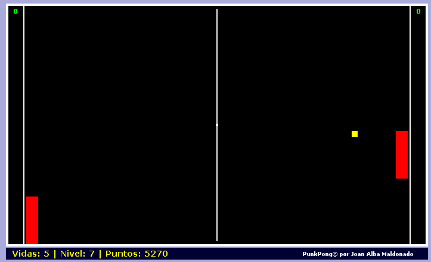

PunkPong 
========= 
by Joan Alba Maldonado (joanalbamaldonadoNO_SPAM_PLEASE AT gmail DOT com, without NO_SPAM_PLEASE)

Pong alike game totally written in DHTML.

Version: 0.26a 
- Date: 20th February 2006 (approximately).

You can donate at http://sourceforge.net/donate/index.php?group_id=173646

## Description

Open source Pong clone totally written in DHTML (HTML, CSS and JavaScript).

It is my second DHTML game and was made in early 2006.

It allows you to use either mouse or keyboard to control your paddle.

Despite the fact that it is very easy in the beginning, the difficulty increases slowly every level and the computer will be much harder to beat.

You can also change the game behaviour easily by editing many of the configuration variables which are at the beginning of the script.

This game doesn't use any image at all, just pure HTML and CSS.

Official languages are Spanish and English.

You can find other modified and adapted versions of this game on the Internet, including one Opera widget and even a Drupal module.

This game has been tested under BeOS, Linux, NetBSD, OpenBSD, FreeBSD, Windows, Mac OS X, BlackBerry Tablet OS, Android, iOS and others.

Play online in English: http://punkpong.tuxfamily.org/punkpong_english/

Play online in English (mirror): http://www.dhtmlgames.com/punkpong/punkpong_english/

Play online in Spanish: http://punkpong.tuxfamily.org/punkpong_spanish/

Play online in Spanish (mirror): http://www.dhtmlgames.com/punkpong/punkpong_spanish/

Official web site: http://punkpong.tuxfamily.org/ (mirror at http://www.dhtmlgames.com/punkpong/).

## License

This project can be used, reproduced, distributed and modified freely for any non-commercial purposes but always keeping the author's name and copyright clauses. Other than that, just use this project as you wish but never sell it!